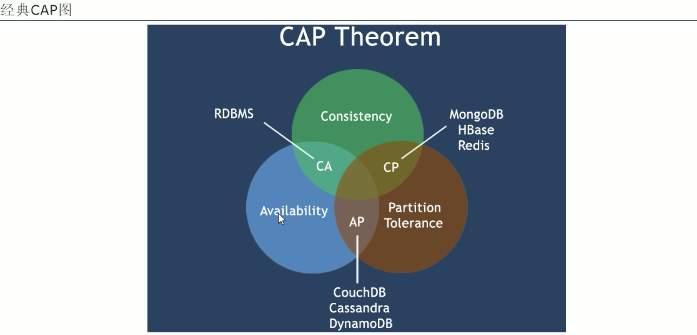

# 6. 分布式数据库 CAP原理: CAP + BASE

## 6.1 传统的 ACID是什么？

* A(Automicity): 原子性
* C(Consistency): 一致性
* I(Isolation): 独立性
* D(Durability): 持久性

## 6.2 CAP
* C(Consistency): 强一致性
* A(Availability): 可用性
* P(Partition tolerance): 分区容错性

### CAP的3进2
CAP核心理论: 一个分布式系统不可能同时满足 强一致性、可用性、分区容错性 这3个需求。

**最多只能同时较好的满足2个。**

因此，根据 CAP原理将 NoSQL数据库分成以下3类:

* 满足CA原则: 单点集群，满足一致性、可用性的系统，通常在可扩展性上不太强大
    * Oracle
* 满足CP原则: 满足一致性、分区容错性的系统，通常性能不是特别的高
    * Redis
    * Mongodb
* 满足AP原则: 满足可用性、分区容错型的系统，通常可能对一致性要求低一些
    * 大多数网站架构的选择

`注意`: 分布式架构的时候必须做出取舍(由于当前网络硬件肯定会出现延迟、丢包等情况，所以分区容忍性使我们必须要实现的，只能在一致性和高可用性之间权衡)。

> 一致性和可用性的抉择
> * 数据库事务一致性需求
> 
> 很多web实时系统并不要求严格的数据库事务，对读的一致性要求很低，有些场合对写的一致性要求并不高。允许实现最终一致性。
> 
> * 数据库的 写实时性 和 读实时性需求
> 
> 对关系型数据库来说，插入一条数据之后立刻查询，是肯定可以读出这条数据的，但是对于很多web应用来说，并不要求这么高的实时性，比方说，发一条消息后，过几秒乃至十几秒后，我的订阅者才看到这条动态是完全可接受的。
> 
> * 对复杂的SQL查询(特别是多表关联查询的需求)
>
> 任何数据量大的 web系统，都非常忌讳多个大表的关联查询，以及复杂的数据分析类型的报表查询，特别是SNS类型网站，从需求以及产品设计角度等，就避免了这种情况的产生。往往更多的是单表的主键查询，以及单表的简单条件分页查询，SQL的功能被极大的弱化了。

## 6.3 BASE
BASE 是为了解决 关系型数据库强一致性 引起的问题而 引起的可用性降低而提出的解决方案。

### BASE的概念
* BA(Basically Availabel): 基本可用 
* S(Soft state): 软状态
* E(Eventually consistent): 最终一致

### BASE 思想
通过让系统 放松对某一时刻数据一致性 的要求来 换取系统整体伸缩性和性能上 改观。

为什么？
答: 由于大型系统往往由于地域分布和极高性能的要求，不可能采用分布式事务来完成这些指标，要想获得这些指标，我们必须采用另一种方式来完成，BASE就是解决方案。
