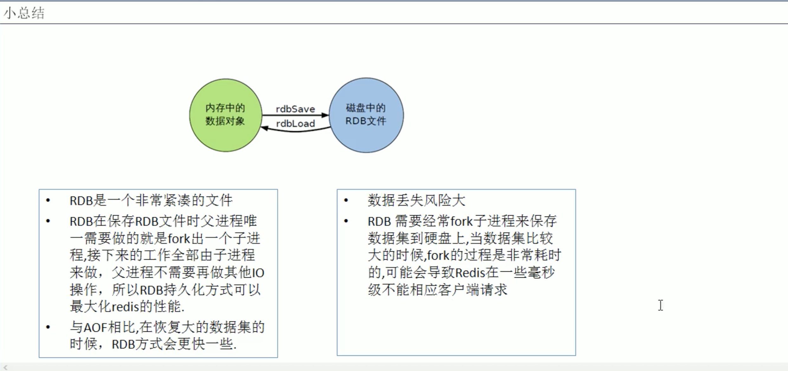

# 1. RDB

## 1.1 RDB是什么？
指定时间间隔内将内存中的数据集快照写入磁盘，也就是行话讲的 Snapshot快照，它恢复时是将快照文件直接读到内存中。

Redis会单独创建(fork)一个子进程进行持久化，会先将数据写入到一个临时文件，待持久化过程结束了，再用这个临时文件替换上次持久化好的文件。

整个过程中，主进程是不进程任何IO操作的，这就确保了极高的性能。如果需要进行大规模数据的恢复，且对于数据恢复的完整性不是非常敏感，那RDB方案要比AOF方案更加的高效。

> RDB保存的是 dump.rdb文件。


## 1.2 Fork作用
Fork作用: 复制1个与当前进程一样的进程。

新进程的所有数据(变量、环境变量、程序计数器等)数值都和原进程一致，但是是一个全新的进程，并作为原进程的子进程。


## 1.3 RDB配置: SNAPSHOTTING

```shell
################################ SNAPSHOTTING  ################################
#
# Save the DB on disk:
#
#   save <seconds> <changes>
#
#   Will save the DB if both the given number of seconds and the given
#   number of write operations against the DB occurred.
#
#   In the example below the behaviour will be to save:
#   after 900 sec (15 min) if at least 1 key changed
#   after 300 sec (5 min) if at least 10 keys changed
#   after 60 sec if at least 10000 keys changed
#
#   Note: you can disable saving completely by commenting out all "save" lines.
#
#   It is also possible to remove all the previously configured save
#   points by adding a save directive with a single empty string argument
#   like in the following example:
#
#   save ""

save 900 1
save 300 10
save 60 10000

# By default Redis will stop accepting writes if RDB snapshots are enabled
# (at least one save point) and the latest background save failed.
# This will make the user aware (in a hard way) that data is not persisting
# on disk properly, otherwise chances are that no one will notice and some
# disaster will happen.
#
# If the background saving process will start working again Redis will
# automatically allow writes again.
#
# However if you have setup your proper monitoring of the Redis server
# and persistence, you may want to disable this feature so that Redis will
# continue to work as usual even if there are problems with disk,
# permissions, and so forth.
stop-writes-on-bgsave-error yes

# Compress string objects using LZF when dump .rdb databases?
# For default that's set to 'yes' as it's almost always a win.
# If you want to save some CPU in the saving child set it to 'no' but
# the dataset will likely be bigger if you have compressible values or keys.
rdbcompression yes

# Since version 5 of RDB a CRC64 checksum is placed at the end of the file.
# This makes the format more resistant to corruption but there is a performance
# hit to pay (around 10%) when saving and loading RDB files, so you can disable it
# for maximum performances.
#
# RDB files created with checksum disabled have a checksum of zero that will
# tell the loading code to skip the check.
rdbchecksum yes

# The filename where to dump the DB
dbfilename dump.rdb

# The working directory.
#
# The DB will be written inside this directory, with the filename specified
# above using the 'dbfilename' configuration directive.
#
# The Append Only File will also be created inside this directory.
#
# Note that you must specify a directory here, not a file name.
dir ./
```
* SAVE 秒钟 操作次数
```shell
save 900 1
save 300 10
save 60 10000
```
多少秒内多少个更改后执行RDB数据
> redis默认配置文件中提供了3个条件:
> * save 900 1 ==> 900s(15min)内有1个更改
> * save 300 10 ==> 300s(5min)内有10个更改
> * save 60 10000 ==> 60s内有10000个更改

`注意`: 禁用RDB持久化策略，① 不设置任何save指令，② 给save传入空字符串

* Stop-writes-on-bgsave-error

如果配置成no，表示你不在乎数据不一致或者有其他手段发现和控制

```shell
Stop-writes-on-bgsave-error no
```

* rdbcompression

对于存储到磁盘中的快照，可以设置是否进行压缩存储。如果是的话，redis会采用LZF算法进行压缩。如果不想消耗CPU来进行压缩的话，可以设置关闭此功能。

```shell
rdbcompression yes
```

* rdbchecksum

在存储快照后，还可以让redis使用 CRC64算法来进行校验，但是这样做会加大约10%的性能消耗，如果希望获得最大的性能提升，可以关闭此功能。

```shell
rdbchecksum yes
```


## 1.4 如何触发RDB快照？
* 配置文件中配置的快照配置: 冷拷贝后重新使用
* 命令`save`或`bgsave`
* 执行 `flushall`命令，也会产生 dump.rdb文件，但里面是空的，无意义。


## 1.5 如何恢复RDB？
将备份文件(dump.rdb)移动到redis安装目录并启动服务即可。

```shell
CONFIG get dir #获取目录
```


## 1.6 RDB优势
* 适合大规模数据
* 对数据完整性和一致性要求不高


## 1.7 RDB劣势
* 在一定间隔时间做一次备份，所以如果 redis意外down掉的话，就会丢失最后一次快照的所有修改
* Fork的时候，内存中的数据被克隆了一份，大致2倍的膨胀性需要考虑


## 1.8 如何停止RDB
动态所有停止RDB保存的方法:
```shell
redis-cli config set save ""
```


## 1.9 RDB总结

