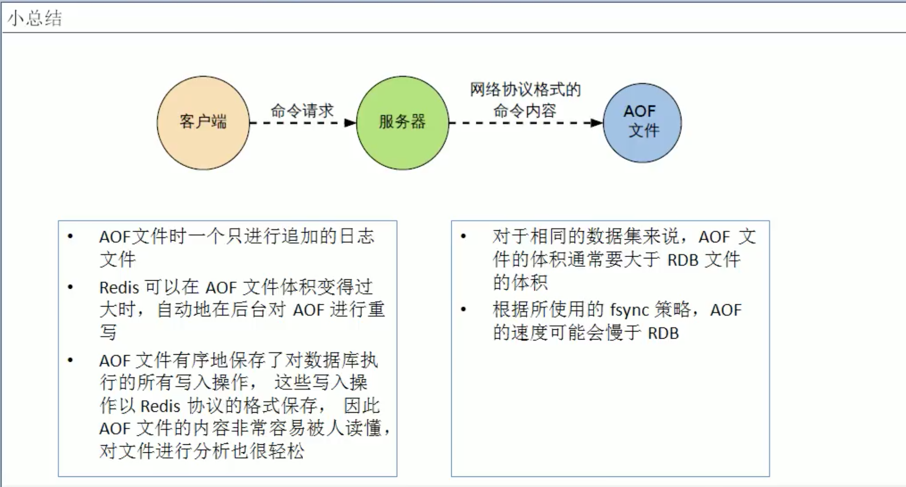

# 2. AOF

## 2.1 AOF是什么？
以日志的形式来记录每个写操作，将 Redis执行过程的所有写指令记录下来(读操作不记录)，只许追加文件但不可以改写文件。

Redis启动之初会读取该文件重新构建数据，换言之，Redis重启的话就根据日志文件的内容将写指令从前到后执行一次以完成数据的恢复工作。

> AOF保存的是 appendonly.aof文件。


## 2.2 AOF 配置: APPEND ONLY MODE

```shell
############################## APPEND ONLY MODE ###############################

# By default Redis asynchronously dumps the dataset on disk. This mode is
# good enough in many applications, but an issue with the Redis process or
# a power outage may result into a few minutes of writes lost (depending on
# the configured save points).
#
# The Append Only File is an alternative persistence mode that provides
# much better durability. For instance using the default data fsync policy
# (see later in the config file) Redis can lose just one second of writes in a
# dramatic event like a server power outage, or a single write if something
# wrong with the Redis process itself happens, but the operating system is
# still running correctly.
#
# AOF and RDB persistence can be enabled at the same time without problems.
# If the AOF is enabled on startup Redis will load the AOF, that is the file
# with the better durability guarantees.
#
# Please check http://redis.io/topics/persistence for more information.

appendonly no

# The name of the append only file (default: "appendonly.aof")

appendfilename "appendonly.aof"

# The fsync() call tells the Operating System to actually write data on disk
# instead of waiting for more data in the output buffer. Some OS will really flush
# data on disk, some other OS will just try to do it ASAP.
#
# Redis supports three different modes:
#
# no: don't fsync, just let the OS flush the data when it wants. Faster.
# always: fsync after every write to the append only log. Slow, Safest.
# everysec: fsync only one time every second. Compromise.
#
# The default is "everysec", as that's usually the right compromise between
# speed and data safety. It's up to you to understand if you can relax this to
# "no" that will let the operating system flush the output buffer when
# it wants, for better performances (but if you can live with the idea of
# some data loss consider the default persistence mode that's snapshotting),
# or on the contrary, use "always" that's very slow but a bit safer than
# everysec.
#
# More details please check the following article:
# http://antirez.com/post/redis-persistence-demystified.html
#
# If unsure, use "everysec".

# appendfsync always
appendfsync everysec
# appendfsync no

# When the AOF fsync policy is set to always or everysec, and a background
# saving process (a background save or AOF log background rewriting) is
# performing a lot of I/O against the disk, in some Linux configurations
# Redis may block too long on the fsync() call. Note that there is no fix for
# this currently, as even performing fsync in a different thread will block
# our synchronous write(2) call.
#
# In order to mitigate this problem it's possible to use the following option
# that will prevent fsync() from being called in the main process while a
# BGSAVE or BGREWRITEAOF is in progress.
#
# This means that while another child is saving, the durability of Redis is
# the same as "appendfsync none". In practical terms, this means that it is
# possible to lose up to 30 seconds of log in the worst scenario (with the
# default Linux settings).
#
# If you have latency problems turn this to "yes". Otherwise leave it as
# "no" that is the safest pick from the point of view of durability.

no-appendfsync-on-rewrite no

# Automatic rewrite of the append only file.
# Redis is able to automatically rewrite the log file implicitly calling
# BGREWRITEAOF when the AOF log size grows by the specified percentage.
#
# This is how it works: Redis remembers the size of the AOF file after the
# latest rewrite (if no rewrite has happened since the restart, the size of
# the AOF at startup is used).
#
# This base size is compared to the current size. If the current size is
# bigger than the specified percentage, the rewrite is triggered. Also
# you need to specify a minimal size for the AOF file to be rewritten, this
# is useful to avoid rewriting the AOF file even if the percentage increase
# is reached but it is still pretty small.
#
# Specify a percentage of zero in order to disable the automatic AOF
# rewrite feature.

auto-aof-rewrite-percentage 100
auto-aof-rewrite-min-size 64mb

# An AOF file may be found to be truncated at the end during the Redis
# startup process, when the AOF data gets loaded back into memory.
# This may happen when the system where Redis is running
# crashes, especially when an ext4 filesystem is mounted without the
# data=ordered option (however this can't happen when Redis itself
# crashes or aborts but the operating system still works correctly).
#
# Redis can either exit with an error when this happens, or load as much
# data as possible (the default now) and start if the AOF file is found
# to be truncated at the end. The following option controls this behavior.
#
# If aof-load-truncated is set to yes, a truncated AOF file is loaded and
# the Redis server starts emitting a log to inform the user of the event.
# Otherwise if the option is set to no, the server aborts with an error
# and refuses to start. When the option is set to no, the user requires
# to fix the AOF file using the "redis-check-aof" utility before to restart
# the server.
#
# Note that if the AOF file will be found to be corrupted in the middle
# the server will still exit with an error. This option only applies when
# Redis will try to read more data from the AOF file but not enough bytes
# will be found.
aof-load-truncated yes

# When rewriting the AOF file, Redis is able to use an RDB preamble in the
# AOF file for faster rewrites and recoveries. When this option is turned
# on the rewritten AOF file is composed of two different stanzas:
#
#   [RDB file][AOF tail]
#
# When loading Redis recognizes that the AOF file starts with the "REDIS"
# string and loads the prefixed RDB file, and continues loading the AOF
# tail.
aof-use-rdb-preamble yes
```
* appendonly: 开启/关闭aof持久化
```shell
appendonly no
```
默认是no，yes打开aof持久化。


* appendfilename: aof持久化文件名

```shell
appendfilename "appendonly.aof"
```

* appendfsync: 同步持久化的策略
    * Always: 同步持久化，每次发生数据变更会被立即记录到磁盘，性能较差但数据完整性比较好
    * Everysec(默认): 异步操作，每秒记录，如果一秒内宕机，有数据丢失
    * No: 

* No-appendfsync-on-write
重写时是否可以运用 Appendfsync，默认no，保证数据安全。

```shell
No-appendfsync-on-write no
```

* Auto-aof-rewrite-min-size
设置重写的基准值，单位为MB，默认64
```shell
auto-aof-rewrite-min-size 64mb
```

* Auto-aof-rewrite-percentage
设置重写的基准值，默认100%
```shell
auto-aof-rewrite-percentage 100
```


## 2.3 aof启动/修复/恢复
### 正常恢复
* 启动: appendonly设置yes
```shell
appendonly yes
```
* 将有数据的aof文件复制一份保存到对应目录
```shell
config get dir
```
* 恢复: 重启redis，然后重新加载

### 异常恢复
* 启动: appendonly设置yes
```shell
appendonly yes
```
* 备份被写坏的AOF文件
* 修复: redis-check-aof --fix
```shell
redis-check-aof --fix appendonly.aof
```
* 恢复: 重启redis，然后重新加载


## 2.4 Rewrite
### Rewrite是什么？

AOF采用文件追加方式，文件会越来越大为避免出现这种文件，新增了重写机制，当AOF文件的大小超过所设定的阈值时，redis就会启动AOF文件的内容压缩，只保留可以恢复数据的最小指令集，可以使用命令 `bgrewriteaof`。

### 重写原理

AOF文件持续增长而过大时，会fork出一条新进程来将文件重写(也是先写临时文件最后再rename)，遍历新进程的内存中的数据，每条记录有一条set语句。

重写aof文件的操作，并没有读取旧的aof文件，而是将整个内存中的数据库内容用命令的方式重写了一个新的aof文件，这点和快照有点类似。

    
### 触发机制
redis会记录上次重写时的AOF大小，默认配置是当AOF文件大小是上次rewrite后大小的一倍，且文件大于64MB时触发。


## 2.5 AOF优势
每秒同步: 同步持久化，每次发生数据变更会被立即记录到磁盘，性能较差但数据完整性比较好
每修改同步: 异步操作，每秒记录，如果一秒内宕机，有数据丢失
不同步: 从不同步


## 2.6 AOF劣势
* 相同数据集的数据而言，aof文件 远大于 rbd文件，恢复速度 慢于 rdb
* AOF运行效率要慢于rdb，每秒同步策略效率较好，不同步效率和rdb相同。


## 2.7 AOF总结

